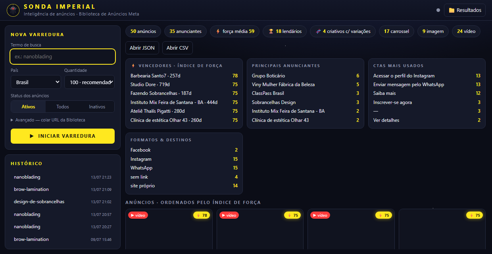
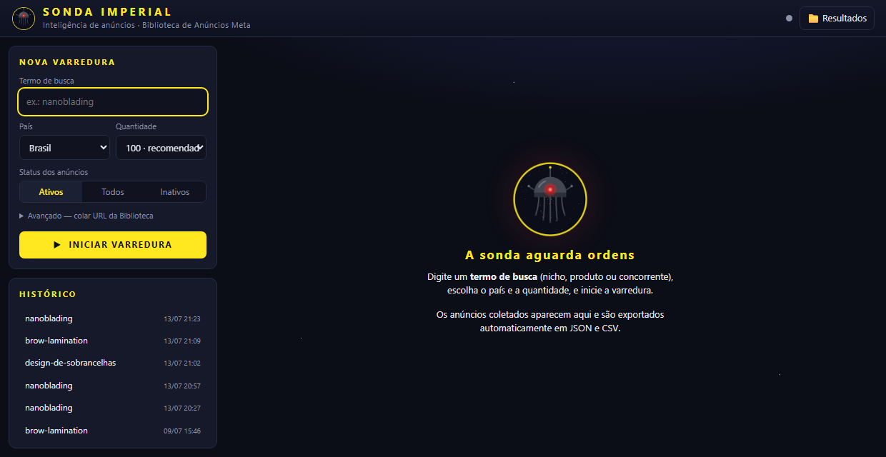

<div align="center">


# Sonda Imperial

**Inteligência de anúncios da Biblioteca de Anúncios do Facebook/Meta — sem login, sem API paga, sem limites.**

Extraia todos os anúncios de um nicho ou concorrente, descubra quais criativos estão *realmente* performando (não só rodando) e monte insights de copy e formato em minutos.

[Como funciona](#como-funciona) ·
[Instalação](#instalação) ·
[Aplicação desktop](#aplicação-desktop--sonda-imperial) ·
[Índice de Força](#-índice-de-força-pontuação-dos-anúncios) ·
[Linha de comando](#uso-pela-linha-de-comando) ·
[Contribuindo](#contribuindo)

</div>

---

## O que é

A [Biblioteca de Anúncios do Facebook](https://www.facebook.com/ads/library/) é pública e mostra todo anúncio ativo (ou já veiculado) na Meta — mas navegar manualmente, anúncio por anúncio, para analisar a concorrência é lento e não escala.

A **Sonda Imperial** automatiza essa coleta: aponta para um termo de busca ou URL, e ela devolve todos os anúncios correspondentes com criativos, textos, CTAs, formatos, plataformas e uma **pontuação de força** que aponta quais criativos são vencedores comprovados — tudo isso em uma aplicação desktop com tema Star Wars, ou por linha de comando para quem prefere automatizar.

Não usa nenhuma API paga do Facebook nem precisa de login: abre a página pública em um navegador automatizado (Chromium via [Playwright](https://playwright.dev/)) e intercepta as respostas internas que a própria página já carrega ao rolar a lista de resultados.

<p align="center">
  
</p>

## Por que existe

Ferramentas equivalentes (ex.: actors pagos do Apify) cobram por execução ou por resultado. Este projeto entrega o mesmo dado — extração completa de criativos, textos e metadados da Ad Library — como código aberto, rodando localmente, sem custo por uso e sem limite de volume.

## Como funciona

1. Você informa um termo de busca (ex.: `"nanoblading"`), país e quantidade desejada — ou cola uma URL da Ad Library com filtros avançados.
2. A ferramenta monta a URL de busca e abre a Biblioteca de Anúncios num Chromium headless.
3. Conforme a página rola automaticamente, a Ad Library carrega mais resultados via chamadas GraphQL internas — a ferramenta intercepta essas respostas de rede diretamente (sem depender de `doc_id`/tokens internos do Facebook, que mudam com frequência — por isso é resistente a atualizações do site).
4. Cada anúncio é normalizado para um schema plano e consistente, pontuado pelo [Índice de Força](#-índice-de-força-pontuação-dos-anúncios), e exportado em **JSON** e **CSV**.

## Instalação

Requer **Python 3.9+** (testado com 3.12) e Windows, macOS ou Linux.

```bash
git clone https://github.com/SaldanhaC3/sonda-imperial.git
cd sonda-imperial
pip install -r requirements.txt
playwright install chromium
```

Isso instala as dependências (`playwright`, `rich`, `flask`, `pywebview`) e baixa o Chromium que o Playwright usa internamente (~200 MB, download único).

## Aplicação desktop — Sonda Imperial

<p align="center">
  
</p>

A forma mais fácil de usar é a interface gráfica:

```bash
python SondaImperial.pyw
# ou, sem abrir console (Windows):
pythonw SondaImperial.pyw
```

Isso sobe um servidor local (Flask, porta `8674`) e abre uma janela nativa (via [pywebview](https://pywebview.flowrl.com/)) com:

- **Formulário de varredura** — termo, país, quantidade (50/100/300/ilimitado) e status dos anúncios, com barra de progresso e botão de cancelar
- **Painéis de inteligência automáticos** — vencedores por Índice de Força, principais anunciantes, CTAs mais usados, formatos e destinos dos links (WhatsApp, Instagram, site próprio)
- **Detecção de variações de criativo** — quando o mesmo anunciante replica um criativo em vários anúncios, eles ganham um selo 🧬 clicável que filtra o grupo (veja [abaixo](#-detecção-de-variações-de-criativo))
- **Galeria de criativos** ordenada por força, com miniatura, badge de vídeo, CTA e link direto para o anúncio na Biblioteca
- **Histórico clicável** de varreduras anteriores e botões para abrir o JSON/CSV exportados

### Criando um atalho na área de trabalho (Windows)

```powershell
$py = Split-Path (Get-Command python).Source
$pythonw = Join-Path $py "pythonw.exe"
$proj = (Get-Location).Path
$ws = New-Object -ComObject WScript.Shell
$sc = $ws.CreateShortcut("$env:USERPROFILE\Desktop\Sonda Imperial.lnk")
$sc.TargetPath = $pythonw
$sc.Arguments = '"' + (Join-Path $proj "SondaImperial.pyw") + '"'
$sc.WorkingDirectory = $proj
$sc.IconLocation = (Join-Path $proj "assets\sonda.ico") + ",0"
$sc.Save()
```

## ⚡ Índice de Força (pontuação dos anúncios)

Nem todo anúncio ativo é um anúncio bom — mas um anúncio que **fica meses no ar, é replicado em várias variações e roda em várias plataformas** quase certamente está performando (senão o anunciante o teria pausado). O Índice de Força (0–100) formaliza essa lógica para você priorizar onde estudar:

| Sinal | Peso | Satura em |
|---|---|---|
| Tempo no ar (`days_running`) | 60 pts | 180 dias |
| Variações do criativo (`collation_count`) | 25 pts | 10 variações |
| Amplitude de plataformas | 15 pts | 4 plataformas |

Anúncios já inativos recebem penalidade de 30% no score (tiveram vida, mas não sobreviveram). Classificação (`force_tier`):

| Tier | Score | Leitura |
|---|---|---|
| 🏆 **lendário** | 70+ | Veterano escalado — estude e modele |
| 💪 **forte** | 45–69 | Sobrevivente comprovado |
| 🔵 **regular** | 20–44 | Ainda se provando |
| ⚪ **em teste** | <20 | Recém-lançado — observe, não copie ainda |

Os campos `force_score`, `force_tier` e `days_running` saem em todo anúncio do JSON e nas primeiras colunas do CSV. Na aplicação desktop, a galeria é ordenada por essa pontuação e há um painel dedicado aos "Vencedores".

## 🧬 Detecção de variações de criativo

Quando o mesmo anunciante (mesma página) publica o mesmo texto de anúncio em várias entradas separadas da Biblioteca — comum em testes A/B de imagem/vídeo com a mesma copy — a Sonda Imperial agrupa essas variações automaticamente e rotula os grupos (A, B, C...) por tamanho. Um selo colorido aparece em cada card do grupo; clicar nele filtra a galeria para mostrar só aquele conjunto. Criativos com Índice de Força alto **e** selo de variação são o sinal mais forte da amostra: validados pelo tempo *e* escalados deliberadamente.

## Uso pela linha de comando

### Modo simples (palavra-chave)

Não precisa de URL — informe só o termo de busca:

```bash
python -m fb_ads_scraper --keyword "nanoblading" --country BR --max-results 100
```

### Modo URL (filtros avançados)

1. Acesse a [Biblioteca de Anúncios](https://www.facebook.com/ads/library/), monte sua busca (palavra-chave, país, status, tipo de mídia...).
2. Copie a URL completa da barra de endereços.
3. Execute:

```bash
python -m fb_ads_scraper "https://www.facebook.com/ads/library/?active_status=active&ad_type=all&country=BR&q=fitness&search_type=keyword_unordered" --max-results 100
```

Os arquivos são gravados em `output/fb_ads_<busca>_<data-hora>.json` e `.csv`.

### Opções

| Opção | Descrição | Padrão |
|---|---|---|
| `--keyword TERMO` | Busca por palavra-chave (dispensa a URL) | — |
| `--country XX` | País no modo keyword (`ALL` = todos) | `BR` |
| `--status active\|inactive\|all` | Status no modo keyword | `active` |
| `--max-results N` | Limite de anúncios (0 = ilimitado) | `0` |
| `--format json\|csv\|both` | Formato de saída | `both` |
| `--output DIR` | Pasta de saída | `output/` |
| `--headful` | Abre o navegador visível (depuração) | oculto |
| `--timeout SEG` | Tempo máximo de coleta em segundos | `600` |

Também funciona com URLs de anúncios de uma página específica (`view_all_page_id=...`) e de anúncio único (`id=...`).

### Exemplos

```bash
# Anúncios ativos de "curso online" no Brasil, sem limite
python -m fb_ads_scraper "https://www.facebook.com/ads/library/?active_status=active&ad_type=all&country=BR&q=curso%20online&search_type=keyword_unordered"

# Todos os anúncios de uma página específica, só JSON
python -m fb_ads_scraper "https://www.facebook.com/ads/library/?active_status=all&ad_type=all&country=ALL&view_all_page_id=123456789" --format json

# 50 resultados, navegador visível (útil para depurar)
python -m fb_ads_scraper "<URL>" --max-results 50 --headful
```

## Campos de saída (JSON)

- **Anúncio:** `ad_archive_id`, `ad_title`, `ad_body`, `ad_caption`, `cta_text`, `cta_type`, `link_url`, `link_description`, `display_format`
- **Pontuação:** `force_score`, `force_tier`, `days_running` (veja [Índice de Força](#-índice-de-força-pontuação-dos-anúncios))
- **Mídia:** `images[]` (`original_url`, `resized_url`), `videos[]` (`video_hd_url`, `video_sd_url`, `video_preview_image_url`), `cards[]` (carrossel: título/texto/CTA por card)
- **Página:** `page_name`, `page_id`, `page_like_count`, `page_categories`, `page_profile_uri`, `page_profile_picture_url`
- **Métricas:** `impressions`, `spend`, `reach_estimate`, `currency`, `total_active_time`
- **Campanha:** `start_date`, `end_date`, `is_active`, `publisher_platform[]`, `targeted_or_reached_countries`, `collation_count`

No CSV, listas são achatadas em colunas de texto (`image_original_urls`, `video_urls` etc., separadas por ` | `). O arquivo usa codificação `utf-8-sig` e abre corretamente no Excel.

## Arquitetura do projeto

```
sonda-imperial/
├── fb_ads_scraper/          # núcleo do scraper (usável via CLI ou importado)
│   ├── cli.py                → argparse: modo --keyword ou URL completa
│   ├── scraper.py            → Playwright: auto-scroll + interceptação de /api/graphql/
│   ├── parser.py             → normalização do JSON bruto para o schema plano
│   ├── scoring.py            → cálculo do Índice de Força
│   └── exporter.py           → exportação JSON/CSV
├── app/                      # aplicação desktop (Flask + pywebview)
│   ├── server.py              → API local, agregações, agrupamento de variações
│   ├── templates/index.html
│   └── static/{style.css,app.js}
├── SondaImperial.pyw         # inicializador da janela desktop
├── assets/                   # ícone da aplicação
└── output/                   # resultados exportados (não versionado)
```

Anúncios são identificados na resposta bruta do Facebook por conter as chaves `ad_archive_id` e `snapshot`, em qualquer profundidade da árvore JSON — uma varredura recursiva (`extract_ads_from_payload` em `parser.py`) em vez de um caminho fixo, o que torna a extração resistente a mudanças de estrutura da API interna do Facebook.

## Limitações conhecidas

- **Impressões, gastos e alcance** só são divulgados pelo Facebook para anúncios de temas sociais, eleições ou política (transparência obrigatória). Anúncios comerciais comuns têm esses campos vazios — isso é uma limitação da própria Biblioteca, não do scraper.
- Volume muito alto em sequência pode gerar bloqueio temporário (rate limit) do Facebook. Se acontecer, aguarde alguns minutos ou use `--headful`.
- O Facebook muda o site com frequência; se a coleta parar de funcionar, o ponto mais provável de ajuste é o filtro de respostas em `fb_ads_scraper/scraper.py` (`_on_response`).
- Uso previsto para pesquisa de mercado e inteligência competitiva sobre dados já públicos. Respeite os [Termos de Serviço](https://www.facebook.com/terms) da Meta e a legislação de proteção de dados aplicável ao seu uso.

## Contribuindo

Contribuições são bem-vindas — abra uma *issue* para bugs/ideias ou um *pull request* diretamente. Sugestões de próximos passos:

- Monitoramento recorrente com histórico de sobrevivência de criativos
- Download local dos criativos (as URLs do CDN do Facebook expiram em semanas)
- Transcrição automática de vídeos vencedores
- Comparação lado a lado entre nichos/concorrentes

## Licença

[MIT](LICENSE) — use, modifique e distribua livremente.
